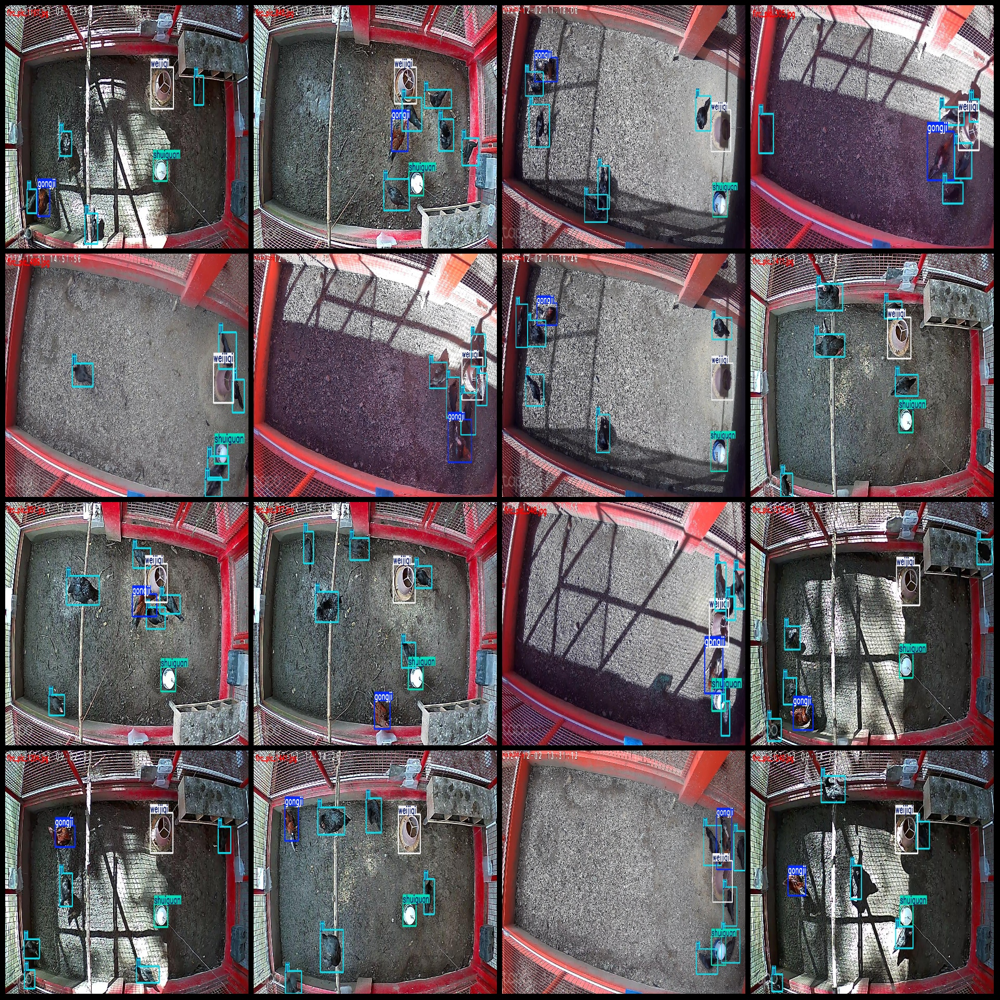
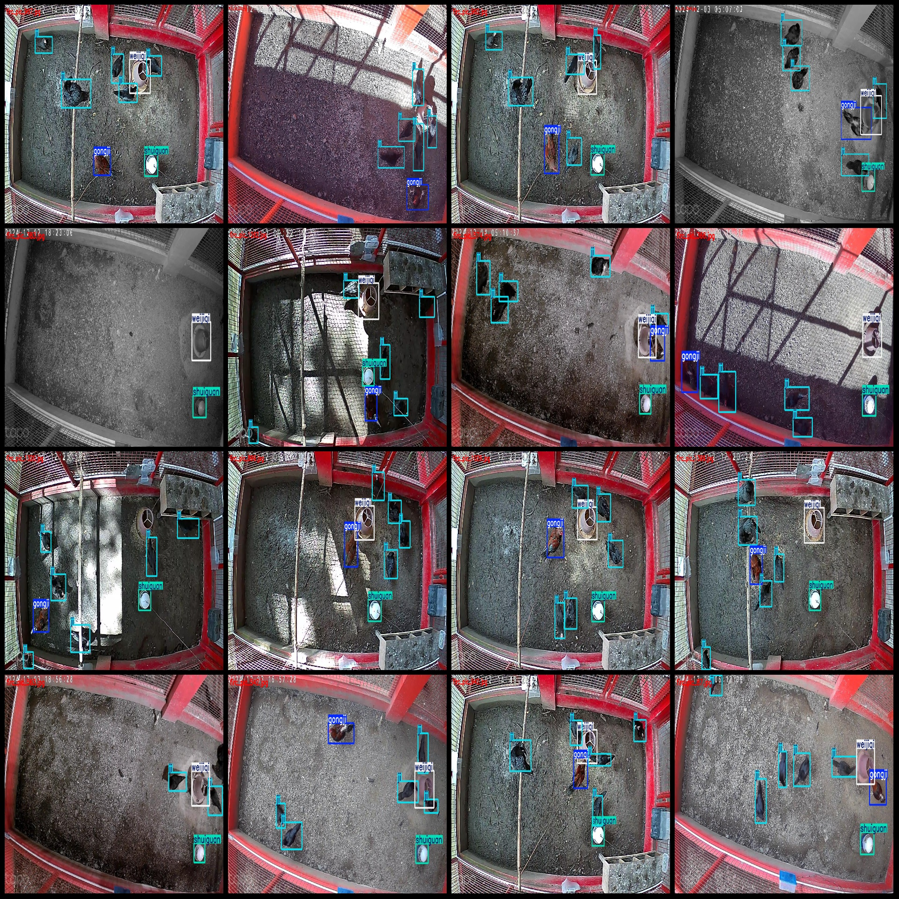

# Chicken Detection Dataset: VOC+YOLO Format with 1588 Images in 4 Categories

The dataset format: Pascal VOC format + YOLO format (without split path txt files, only containing jpg images and corresponding VOC format xml files and yolo format txt files)
Number of images (jpg file count): 1558
Number of annotations (xml file count): 1558
Number of annotations (txt file count): 1558
Number of annotation categories: 4
Annotation category names (note that the order of labels in the yolo format does not correspond to this, but is based on the classes.txt file in the labels folder): ["gongji", "ji", "shuiguan", 
"weijiqi"]
["rooster", "chicken", "water pot", "feeder"]
Number of bounding boxes for each category:
gongji = 1454
ji = 6741
shuiguan = 1425
weijiqi = 1536
Total bounding box count: 11156
Number of images per category:
gongji = 1438
ji = 1544
shuiguan = 1419
weijiqi = 1531
Image resolution: 1280x720
Annotation tool used: labelImg
Annotation rules: Draw a bounding box around the category
Important note: The dataset does not have separate training, validation, or test sets; you will need to manually partition them.
Special notice: This dataset does not guarantee any accuracy for models trained on it or the weight files.
Image preview:
Annotation example:
## Images

Here is a pay link on Stripe ( https://buy.stripe.com/3cs8yP7sY87d0vu9AB ). Please contact me lonlonago@foxmail.com after funding $89, and I will send you a complete data files , thank you!

